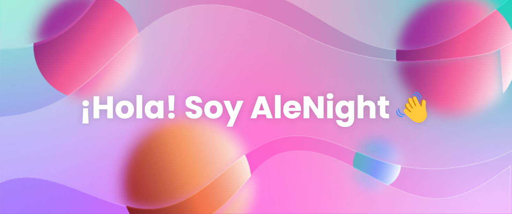

- 🔭 Actualmente trabajo en un proyecto hecho con Jetpack Compose
- 🌱 Estoy aprendiendo JavaScript, C# y Python
- 💬 Preguntenme sobre Kotlin en Android
- 📫 ¿Cómo contactarme?: alejofermir317@gmail.com
- ⚡ Dato curioso: El tema claro es mejor para la concentración.

<h3>Lenguajes</h3>

  
  &nbsp;
  
  &nbsp;
  
  &nbsp;
  
  &nbsp;
  

<h3>Herramientas</h3>

  
  &nbsp;
  
  &nbsp;
  

<!--

-->
